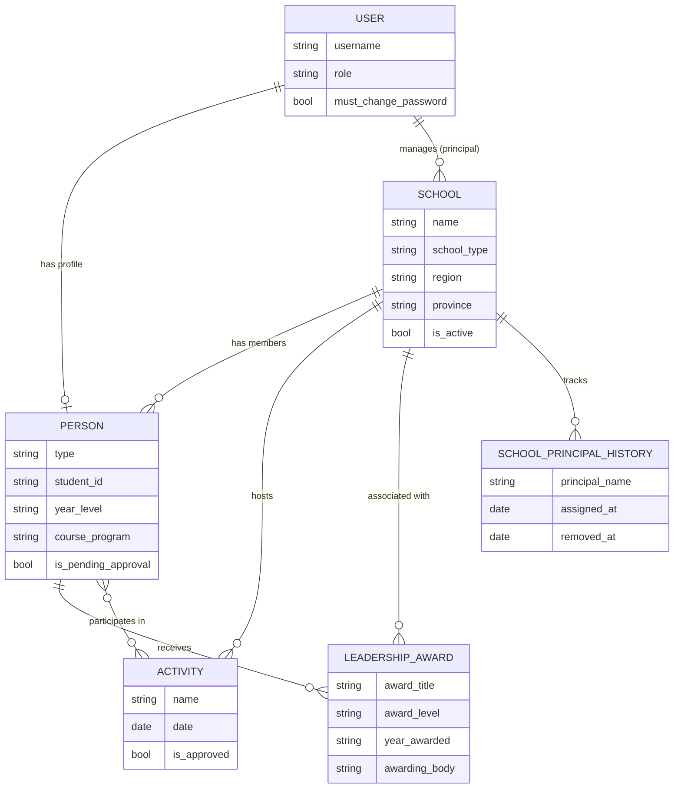
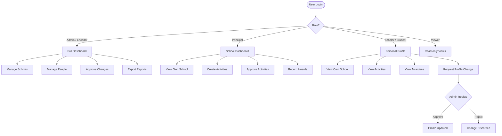

<div align="center">

# 🏫 Leadership Development Program Portal

**A Django-powered records and management system for the Philippine Leadership Development Program —**  
tracking partner schools, scholars, awardees, principals, activities, and professionals.

[](https://python.org)
[](https://djangoproject.com)
[](https://docker.com)
[](https://tailwindcss.com)
[](https://azure.microsoft.com)

</div>

---

## 📸 UI Preview

```
┌─────────────────────────────────────────────────────────────────────┐
│  ▌ LDP Portal            🔔  Admin User  ▾                          │
├──────────┬──────────────────────────────────────────────────────────┤
│          │  Dashboard                                               │
│ 📊 Dash  │  ┌──────────┐  ┌──────────┐  ┌──────────┐  ┌────────┐  │
│ 🏫 Schools│  │ 🏫 Schools│  │ 👥 People │  │ 📅 Events│  │🏆Awards│  │
│ 👥 People │  │    24    │  │   312    │  │    18    │  │   47   │  │
│ 📅 Events │  └──────────┘  └──────────┘  └──────────┘  └────────┘  │
│ 🏆 Awards │                                                          │
│ ⚙ Settings│  Recent Activities          Pending Approvals           │
│          │  ─────────────────────────   ────────────────────────    │
│          │  › Leadership Summit 2025    › Profile change (J. Cruz)  │
│          │  › Science Congress          › Activity request (Annex)  │
└──────────┴──────────────────────────────────────────────────────────┘
```

```
┌─────────────────────────────────────────────────────────────────────┐
│  San Pedro National High School                                     │
│  ┌────────────────────────── Hero Banner ──────────────────────────┐│
│  │  🏫  Logo   San Pedro NHS   ★ Active   📍 Laguna, Region IV-A  ││
│  └─────────────────────────────────────────────────────────────────┘│
│  ┌──────┐  ┌──────┐  ┌──────┐  ┌──────┐  ┌──────┐                 │
│  │  12  │  │  48  │  │  6   │  │  3   │  │ 🏆 5 │                 │
│  │People│  │Events│  │Awards│  │Alumni│  │Awardee│                 │
│  └──────┘  └──────┘  └──────┘  └──────┘  └──────┘                 │
│                                                                     │
│  🏆 Leadership Awardees     │  👥 Members                           │
│  ┌─────────────────────────┐│  ┌─────────────────────────┐         │
│  │ ● Juan Dela Cruz  2024  ││  │ Maria Santos  Scholar   │         │
│  │ ● Ana Reyes       2023  ││  │ Jose Rizal    Student   │         │
│  └─────────────────────────┘│  └─────────────────────────┘         │
└─────────────────────────────────────────────────────────────────────┘
```

---

## ✨ Features

| Module | Capabilities |
|--------|-------------|
| 🏫 **Partner Schools** | School profiles with logo, banner, type (K–12/College/Tech-Voc), location, region/province filtering, active status |
| 👥 **People Records** | Students, Scholars, College members, Professionals, Principals — with profile photos and academic details |
| 📅 **Activities & Events** | Trainings, seminars, conferences — with enrollment tracking and principal-level approval workflow |
| 🏆 **Leadership Awards** | Multi-level awards (School → National), awarding body, certificates, per-school filtering |
| 🔄 **Change Management** | Proposed profile edits held for admin approval before going live |
| 📊 **Reports & Exports** | Excel exports via `openpyxl`, access-scoped data views |
| 🔐 **Role-based Access** | Granular permissions per role across every module |

---

## 🔐 Role Permissions

| Action | Admin | Encoder | Principal | Scholar / Student | Viewer |
|--------|:-----:|:-------:|:---------:|:-----------------:|:------:|
| Manage all schools | ✅ | ✅ | ❌ | ❌ | 👁 |
| Manage own school | ✅ | ✅ | ✅ | ❌ | 👁 |
| Create activities | ✅ | ✅ | ✅ | ❌ | ❌ |
| Approve activities | ✅ | ❌ | ✅ | ❌ | ❌ |
| Record awards | ✅ | ✅ | ✅ | ❌ | 👁 |
| Approve profile changes | ✅ | ❌ | ❌ | ❌ | ❌ |
| View own school's data | ✅ | ✅ | ✅ | ✅ | ✅ |
| Export reports | ✅ | ✅ | ❌ | ❌ | ❌ |

> 👁 = read-only access

---

## 🗂️ Data Model



---

## 🏗️ Application Flow



---

## 🛠️ Tech Stack

| Layer | Technology |
|-------|-----------|
| **Backend** | Python 3.11 · Django 4.2 · Django REST Framework 3.14 |
| **Frontend** | Tailwind CSS v3 (CDN) · Font Awesome 6 Free |
| **Database** | SQLite (dev) · PostgreSQL via `psycopg2` (prod) |
| **Server** | Gunicorn (WSGI) · WhiteNoise (static files) |
| **Storage** | Pillow (images) · Azure Blob Storage (prod media) |
| **Exports** | openpyxl (Excel reports) |
| **Config** | django-environ (`.env` based settings) |
| **Container** | Docker · Docker Compose |
| **Deployment** | Azure App Service / Azure Web App |

---

## 🚀 Local Development

### Prerequisites
- [Docker Desktop](https://www.docker.com/products/docker-desktop/)

### Setup

**1. Clone and start containers**
```bash
git clone https://github.com/lloydismael/LDP.git
cd LDP
docker-compose up --build
```

**2. Apply migrations and create a superuser** *(in a second terminal)*
```bash
docker-compose exec web python manage.py makemigrations
docker-compose exec web python manage.py migrate
docker-compose exec web python manage.py createsuperuser
```

**3. (Optional) Seed demo data**
```bash
docker-compose exec web python manage.py seed_data
```

**4. Open the app**

| URL | Description |
|-----|-------------|
| `http://localhost:8000/` | Main portal |
| `http://localhost:8000/dashboard/` | App dashboard |
| `http://localhost:8000/admin/` | Django admin panel |

---

## 🗺️ URL Structure

```
/dashboard/                  ← Overview stats
/schools/                    ← Partner schools list
/schools/<id>/               ← School detail (stats, members, awards)
/people/                     ← Members directory
/people/<id>/                ← Individual profile + Quick Actions
/activities/                 ← Events & trainings
/activities/<id>/            ← Activity detail
/awards/                     ← Leadership awardees (school-scoped)
/change-management/          ← Pending profile approval queue
/profile/                    ← My profile settings
/change-password/            ← Password change
/admin/                      ← Django admin (superuser only)
```

---

## ☁️ Azure Deployment

**Required environment variables** (App Service → Configuration → Application Settings):

| Variable | Description |
|----------|-------------|
| `SECRET_KEY` | Django secret key |
| `DJANGO_ALLOWED_HOSTS` | Comma-separated hostnames |
| `DATABASE_URL` | PostgreSQL connection string |
| `AZURE_ACCOUNT_NAME` | Azure Storage account name |
| `AZURE_ACCOUNT_KEY` | Azure Storage account key |
| `AZURE_MEDIA_CONTAINER` | Blob container for media files |
| `DEBUG` | Set to `False` in production |

**Deployment steps:**
```bash
# Build image and push to registry
docker build -t ldp-portal .

# Or deploy directly via Azure CLI
az webapp up --name ldp-portal --resource-group <rg> --runtime "PYTHON|3.11"
```

Static files are served by **WhiteNoise**. Media files in production should use **Azure Blob Storage** via `django-storages`.

---

## 📁 Project Structure

```
GRF/
├── config/                  # Django settings, URLs, WSGI
├── ldp_core/                # Main application
│   ├── models.py            # User, School, Person, Activity, Award
│   ├── views.py             # Class-based & function views
│   ├── urls.py              # URL routing
│   ├── forms.py             # ModelForms
│   ├── admin.py             # Django admin registrations
│   └── management/          # Custom management commands (seed_data)
├── templates/
│   └── ldp_core/            # All HTML templates
│       ├── base_app.html    # Base layout (sidebar, topbar)
│       ├── dashboard.html
│       ├── school_detail.html
│       ├── person_detail.html
│       ├── activity_list.html
│       ├── award_list.html
│       └── ...
├── media/                   # Uploaded files (dev only)
├── Dockerfile
├── docker-compose.yml
└── requirements.txt
```

---

## 🎨 Design System

| Token | Value | Usage |
|-------|-------|-------|
| `primary` | `#4F46E5` (Indigo) | Buttons, active states, links |
| `secondary` | `#10B981` (Emerald) | Success badges, active pills |
| `navy` | `#1E293B` | Sidebar background |
| `lightbg` | `#F8FAFC` | Page backgrounds |
| `.glass-card` | White bg + shadow + rounded-2xl | All content cards |
| Bouncy spring | `cubic-bezier(0.34, 1.56, 0.64, 1)` | Sidebar links, stat cards |

---

<div align="center">

Built for the **Philippine Leadership Development Program** · Powered by Django & Docker

</div>
